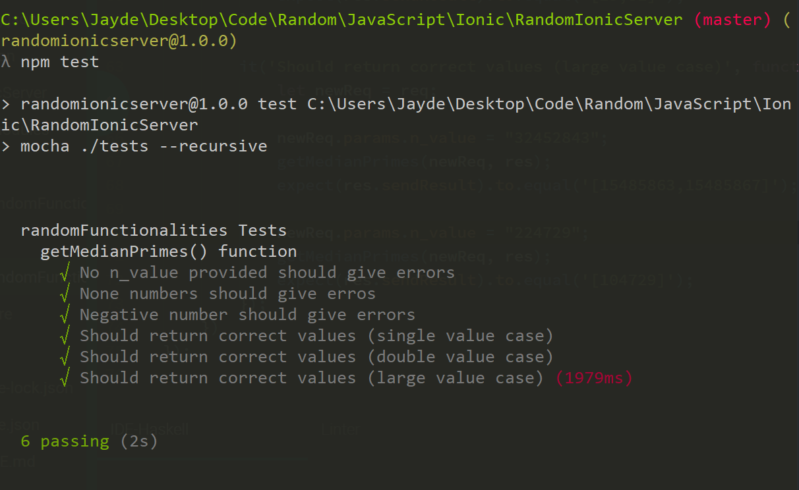
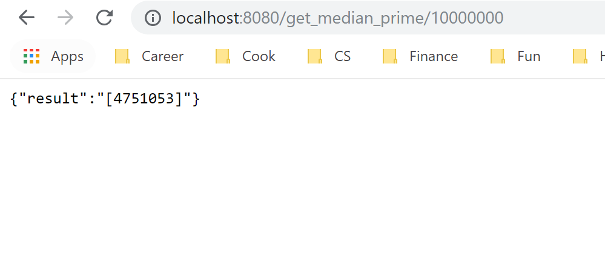

# Random Ionic Server

[Full demo using ionic on Firebase](https://jayde-random-ionic.firebaseapp.com). For this, you need to press 'enter' or press somewhere else on the screen after typing a number for the result to show. When you first load this, there might be a delay before the result shows, but several seconds later the speed should return to normal.

[Backend server using express demo on Heroku](https://jayde-randomionicserver.herokuapp.com)

[Front end repo link](https://github.com/JaydeYue/RandomIonicFrontEnd)

## Currently have
Getting median of prime numbers before a positive N. 

# Setup

Using Express and Node.js for the backend. Make sure you have recent node installed.

1. **Install Required libraries**

```bash
$ npm install
```

2. **Test**

```bash
$ npm test
```

The tests are in the test folder.



3. **Running locally**

```bash
$ npm start
```

I set it to be on 8080, feel free to change though. Right now it only supports one single route: localhost:8080/get_median_prime/value_of_n, and it will return the median prime number up to and including n as result.


4. **Troubleshoot**

Please google whatever build error you get:) If a build error persists or you find a bug, please contact me through my website. Thank you!
